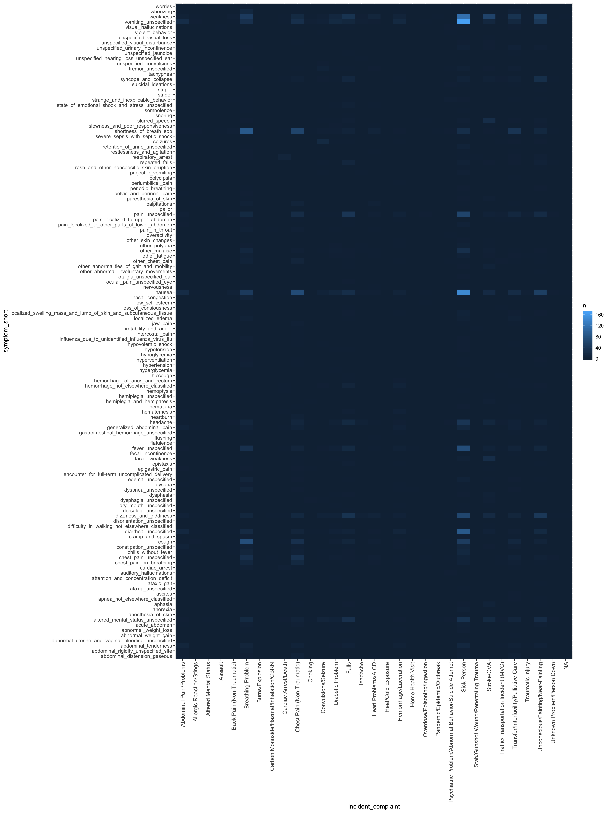
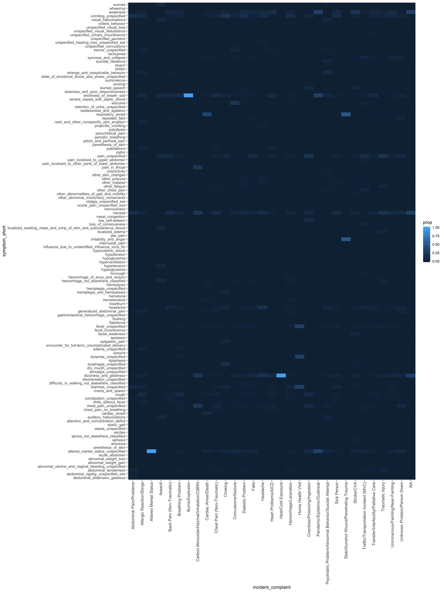

# Overview

Details on the construction of the MedStar EPCR Patient symptom table.   126 unique symptoms were recorded for 2853 calls.  A total of 4086 symptoms were recorded among the calls.


# Load packages and data

```{r setup, include=FALSE}
knitr::opts_chunk$set(comment = NA)
Sys.setenv(TZ = "US/Central")
```

```{r message=FALSE}
library(tidyverse)
library(bfuncs)
```

```{r eval=FALSE}
symptoms <- feather::read_feather("/Users/jaredwiegand/Desktop/DETECT Repository/symptoms.feather")
```

* Adding file path for DETECT data server.    
* Brad emailed Chris Harvey on 2019-02-11 to make Jared an authorized user.

```{r}
symptoms <- feather::read_feather("/Volumes/DETECT/one_year_data/symptoms.feather")
```

```{r}
about_data(symptoms) # 28,228 observations and 2 variables
```

[top](#top)


# Simplify symptom list

Currently, the symptom list includes upper and lower case letters, spaces, and special characters. These are not characteristics we want on our variable names, and they make matching with regular expressions more difficult. We want to do both of those things below. So, here we will:

* Convert all letters to lower case   
* Replace spaces with underscores   
* Replace parentheses with underscores   
* Replace periods with underscores  
* Replace commas with underscores  
* Replace all instances of 2 or more consecutive underscores we created in the process with single underscores   
* Remove trailing underscores   

```{r}
simplify_symptom_strings <- function(x) {
  x %>% 
    tolower() %>% 
    stringr::str_replace_all(pattern = "\\s", replacement = "_") %>% # white space
    stringr::str_replace_all(pattern = "[\\(|\\)]", replacement = "_") %>% # parentheses
    stringr::str_replace_all(pattern = "\\.", replacement = "_") %>% # periods
    stringr::str_replace_all(pattern = "\\,(?=\\_)", replacement = "_") %>% # commas - not separating symptoms
    stringr::str_replace_all(pattern = "\\_{2,}", replacement = "_") %>% # multiple underscores
    stringr::str_replace_all(pattern = "\\_(?=\\')", replacement = "") # trailing underscores
}
```

```{r}
symptoms <- symptoms %>% 
  mutate(symptoms_simplified = simplify_symptom_strings(symptoms))
```

```{r}
about_data(symptoms) # 28,228 observations and 3 variables
```

[top](#top)


# Find all symptoms

* Figure out how to break character stings into component symptoms   
* Get list of all unique symptoms   
* Turn symptoms into binary variables   
* Create new table of symptoms   
* Create two-way table of symptoms by incident complaint   


## Create List of Unique Symptoms

```{r}
symptom_list <- symptoms %>% 
  filter(!is.na(symptoms_simplified)) %>% # Remove NA
  pull(symptoms_simplified) %>% # Coerce to vector 
  unique() %>% # Gets unique groups of symptoms
  stringr::str_split(pattern = "'',''") %>% # Splits character string at '',''
  unlist() %>% # Coerce from list to vector
  stringr::str_remove_all("'") %>% # Remove remaining single quotes
  unique() # Get unique symptoms
```


## Create dummy variables for each symptom, by the same name

```{r}
for (i in seq_along(symptom_list)) {
  symptoms[symptom_list[i]] <- NA
}
rm(i)
```

```{r}
about_data(symptoms) # 28,228 observations and 129 variables
```


## Assign values for each symptom dummy variable

```{r}
for (i in seq_along(symptom_list)) {
  # For each variable in symptoms that shares the name of the i'th value in symptom_list
  symptoms[symptom_list[i]] <- if_else( 
    # If the name of the variable is found anywhere in symptoms_simplified
    # Set the value of that variable to 1 in that row
    # Otherwise set it to 0
    stringr::str_detect(
      string = symptoms$symptoms_simplified, 
      pattern = symptom_list[i]
    ), 1, 0
  )
}
rm(i)
```

```{r}
about_data(symptoms) # 28,228 observations and 129 variables
```

[top](#top)


# Frequency Tables


## Incident complaints

In descending order of occurrence

```{r echo=FALSE}
symptoms %>% 
  group_by(incident_complaint) %>% 
  summarise(n = n()) %>% 
  ungroup() %>% 
  arrange(desc(n)) %>% 
  mutate(percent = n / max(cumsum(n)) * 100)
```


## Incident symptoms

In descending order of occurrence

```{r echo=FALSE}
symptoms %>% 
  select(-incident_complaint, -symptoms, -symptoms_simplified) %>% 
  summarise_all(funs(sum(., na.rm = TRUE))) %>% 
  tidyr::gather(key = "symptom", value = "n") %>% 
  arrange(desc(n)) %>% 
  mutate(percent = n / max(cumsum(n)) * 100)
```


## Cross Tabulation of Incident Complaint by Symptoms

```{r echo=FALSE}
complaint_symptoms_cross <- symptoms %>% 
  select(-symptoms, -symptoms_simplified) %>% 
  group_by(incident_complaint) %>% 
  summarise_if(
    .predicate = is.numeric,
    .funs = funs(sum(., na.rm = TRUE))
  ) %>% 
  print()
```

This table is so large that it is difficult to digest. Let's make a heat map

[top](#top)


# Heat maps

Reorient the table above so that each row is a combination of incident complaint and symptom

```{r}
complaint_symptoms_cross_gathered <- complaint_symptoms_cross %>% 
  
  # Gather symptom columns for heatmap
  group_by(incident_complaint) %>% 
  gather(key = symptom, value = n, -incident_complaint) %>% 
  
  # Make the symptoms shorter/easier to read by removing everything
  # including and after "_r53_1, _k59_00, etc."
  mutate(symptom_short = stringr::str_replace_all(
    string = symptom,
    pattern = "_[a-z]\\d+\\S*",
    replacement = ''
  )) %>% 
  
  # Improve readability
  arrange(incident_complaint, desc(n)) %>% 
  select(incident_complaint, symptom_short, n) %>%  
  print()
```

Some incident complaints, no symptoms are ever recorded. They are:

```{r echo=FALSE}
complaint_symptoms_cross_gathered %>% 
  mutate(cum_n = max(cumsum(n))) %>% 
  filter(cum_n == 0) %>% 
  pull(incident_complaint) %>% 
  unique()
```

We will drop these incident complaints from the data becasue they will add no information to the heatmaps below.

```{r}
complaint_symptoms_cross_gathered <- complaint_symptoms_cross_gathered %>% 
  mutate(cum_n = max(cumsum(n))) %>% 
  filter(cum_n > 0)
```


## Absolute occurrence

Here we are plotting the number of times that given compliant/symptom pair occurred in the data.

```{r}
complaint_symptoms_heatmap <- complaint_symptoms_cross_gathered %>% 
  ggplot() +
    geom_tile(aes(incident_complaint, symptom_short, fill = n)) + 
    theme(
      axis.text.y = element_text(size = 9),
      axis.text.x = element_text(size = 10, hjust = 1, vjust = 0.5, angle = 90)
    )
```

Hard to read in this limited space.    
* Save as image file.   
* Add image to the html page   

```{r}
ggsave(
  filename = "fig_complain_symptom_heatmap.png",
  plot = complaint_symptoms_heatmap,
  device = "png",
  path = "../images",
  width = 15,
  height = 20,
  units = "in"
)
```




## Relative observation of symptoms

For each incident complaint, what was the proportion of times a given symptom was recorded when any symptoms were recorded?

```{r}
relative_symptoms_heatmap <- complaint_symptoms_cross_gathered %>% 

  # Calculate propotions
  mutate(
    prop = n / max(cumsum(n))
  ) %>% 
  
  # Plot heatmap
  ggplot() +
    geom_tile(aes(incident_complaint, symptom_short, fill = prop)) +
    theme(
      axis.text.y = element_text(size = 9),
      axis.text.x = element_text(size = 10, hjust = 1, vjust = 0.5, angle = 90)
    )
```

Hard to read in this limited space.    
* Save as image file.   
* Add image to the html page   

```{r}
ggsave(
  filename = "fig_relative_symptoms_heatmap.png",
  plot = relative_symptoms_heatmap,
  device = "png",
  path = "../images",
  width = 15,
  height = 20,
  units = "in"
)
```



[top](#top)


# Session information

```{r echo=FALSE}
rm(list = ls())
```

```{r echo=FALSE}
sessionInfo()
```

<script src="script.js"></script>